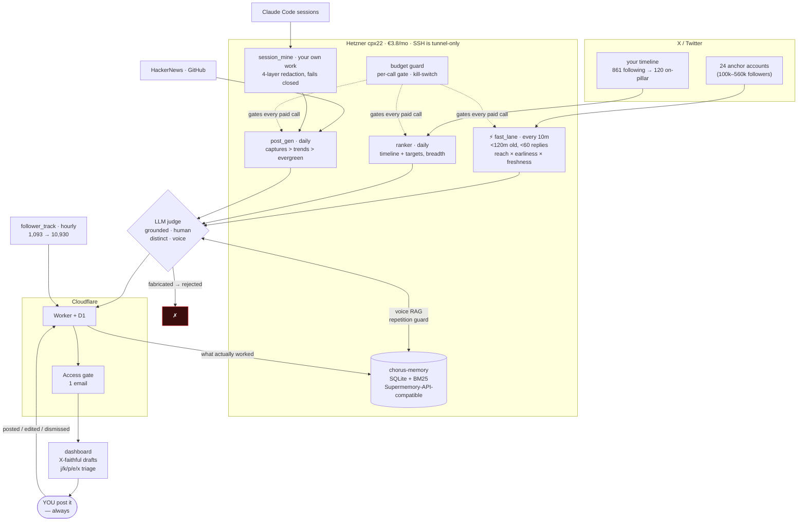

# Chorus — system diagram

## What this actually is (claims you can defend)

- **Suggest-only.** No X write path exists. The agent drafts; you post. Zero ban risk.
- **~$0.15/day.** twitterapi.io reads + DeepSeek drafting, hard-gated by a per-call budget
  check and a kill-switch.
- **The growth thesis is cadence.** Replying 8-21h late earns ~0 impressions. The fast lane
  polls 24 anchors every 10 min and only surfaces tweets <120m old with <60 replies —
  measured live at 0 replies / 213k followers.
- **An LLM judge rejects fabrication.** `grounded=0` for any unverifiable first-person
  claim, because the drafter WILL invent "our logs show 37%" if you let it.
- **Memory is BM25 over what you actually posted** — powering voice priming and a
  repetition guard so it never re-suggests a take you already made.

## Attribution status (what you may honestly claim)

- **Hermes — ✅ TRUE as of 2026-07-15.** Hermes Agent **v0.18.2** is installed on the box
  (`/usr/local/lib/hermes-agent`, data in `/root/.hermes`), wired to OpenRouter, and
  verified with a real LLM round-trip (`hermes -z ...` → `HERMES_LIVE`). Previously this
  was a false claim: `/opt/hermes/` held exactly one file, `INSTALL_ME.txt`.
  Honest scope: Hermes is installed and functional, but the Chorus pipeline (ranker /
  fast_lane / post_gen) still runs as plain Python under cron — it does not yet route
  through Hermes. "Hosted on the box alongside Chorus" is true; "Chorus runs on Hermes"
  is not (yet).
- **Supermemory — ✅ TRUE as of 2026-07-15.** Real upstream Supermemory (`supermemory-server`
  0.0.5) is self-hosted on the box: systemd unit `supermemory`, `127.0.0.1:6767`, encrypted
  local storage, **local** embeddings (`Xenova/bge-base-en-v1.5`, 768d — no embedding API
  spend), graph memory agent via OpenRouter. `SUPERMEMORY_BASE_URL` now points at it and all
  23 documents were migrated off the `chorus-memory` shim with `customId` idempotency.
  Verified: voice/niche/few-shot reads all come from it, and the repetition guard now catches
  *paraphrases* (0.994) that BM25 could not.

  **The swap was NOT the one-env-var change I claimed** — three silent breakages were found
  and fixed first (see `box/test_sm_compat.py`, 14 tests):
  1. upstream returns `chunks[].content`, **no top-level `content`** — every reader got `""`;
  2. upstream **400s on an empty query**, which `niche_context()` sent;
  3. upstream scores **cosine 0..1** vs the shim's unbounded BM25 — `CHORUS_REPEAT_TAU=1.0`
     became unreachable, silently disabling the repetition guard.
  All three sat inside `except: pass`, so nothing would have logged an error. Calibrated on
  real data: exact repeat 1.000, paraphrase 0.994, unrelated 0.558 -> `CHORUS_REPEAT_TAU_COSINE`
  defaults to 0.88.

  The `chorus-memory` shim still runs on `:8000` as a fallback and its SQLite is intact; both
  shapes stay supported by the adapter, so `SUPERMEMORY_BASE_URL` can be flipped back at any time.
